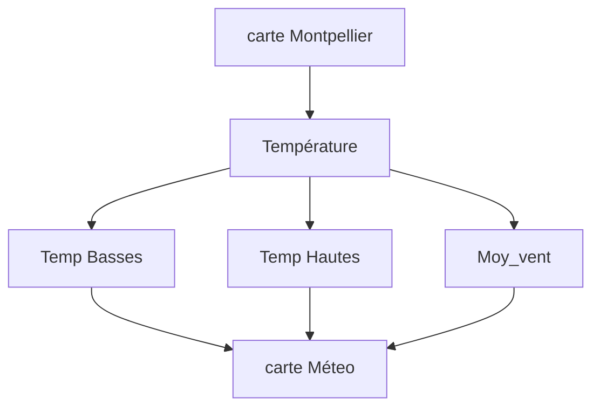

# Montpellier-Weather

## But et Données 

l'Objectif de ce projet est de créer un site Web de prévision météo Pour la ville de Montpellier  dans laquelle , on pourra afficher principalement les températures hautes et basses , suivie de la moyenne du vent et la quantité de précipitation du vent pour les prochains cinq jours. 


 Cette carte se met à jour automatiquement et accessible avec l'URL ... 


 ## Organisation 

 ### Traitement des données 

 Dans un premier temps, nous récoltons les données depuis le site www.openmeteo.fr. Ce dernier te permet d'utiliser les donées sans clefs Api et à l'aide de la librairie (requests) nous obteneons  facilement les données.
 Ensuite  je vais impérativement analyser , filtrer et organiser les données de manière à ce que notre dataframe  soit utilisable .

 ### Visualisation  


 ```mermaid
gantt
    title Montpellier_weather
    dateFormat YYYY-MM-DD
    section Phase 1
        Brainstrorming 1 :a1, 2023-10-10, 10d
        Brainstorming 2  :after a1, 10d
        Snpashot : 2023-10-22
    section Development
        filtrage des données  : a2, 2023-10-22, 10d
        Visualiation   : 2023-11-01, 10d
        Documentation : a3, after a2 , 5d
        Beamer : after a3, 5d
```

 

