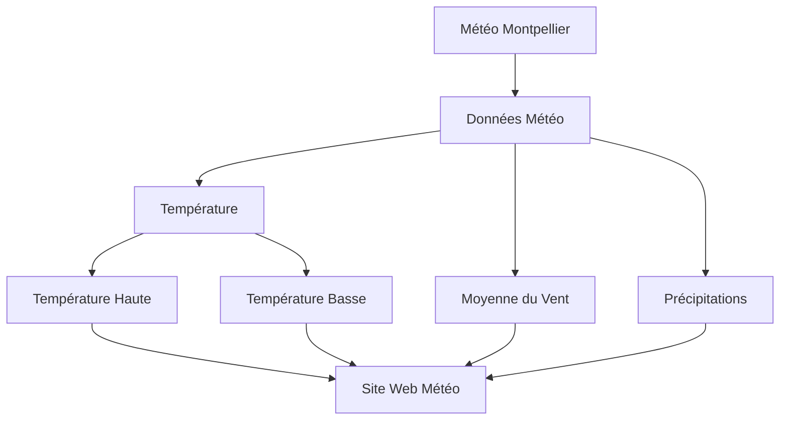

# Montpellier-Weather

## Projet et but   

l'Objectif de ce projet est de créer un site Web de prévision météorologiques Pour la ville de Montpellier. Affichant   principalement les températures hautes et basses ,  la moyenne du vent et la quantité de précipitation  pour les prochains quatre jours. 

 le site web est visible dans ce lien .... 
 ## Aperçu du site web 

 ## Methodologie 

 ### Traitement des données 

 Dans un premier temps, nous faisons la récolte  des données depuis le site www.openmeteo.fr. Ce dernier te permet d'utiliser les donées sans clefs Api et à l'aide de la librairie (requests) nous obteneons  facilement les données, en précisant les variables quotidiennes dans le site que vous voudriez afficher. Ensuite l'analyse et l'organisation des données de manière à ce que notre  dataframe obtenu soit utilisable 
 
 ### Construction du Website

A l'aide d'HTML, CSS, et JavaScript, en utilisant Visual Studio Code comme environnement de développement. La conception du site  est axée sur la simplicité , avec une grille visuelle pour afficher les prévisions météo.

## Intégration de l'API Météo :
Les données météorologiques sont obtenues en temps réel à partir de l'API Open-Meteo. qui sont traitées et organisée sous Python ,puis l'appel au JavaScript et l'outil Fetch pour récupérer les informations sur la température maximale, minimale, les précipitations et la vitesse du vent.

## Personnalisation visuelle :
Chaque jour de la semaine est représenté visuellement avec un pictogramme météo, et la direction du vent est illustrée par une flèche. Ceci se fait essentiellement dans le corps du html , mais en ajoutant le style des classes,La palette de couleurs dans le fichier CSS.

## Source 

-Pour la réalisation du html et du style, je me suis principalement inspirée du sitweb :https://www.meteoblue.com/fr/meteo/semaine/montpellier_france_2992166
-Pour la documentation sur développement des sites Web : https://developer.mozilla.org/en-US/docs/Web
-Vidéo Youtube pour la bonne compréhension des fonctionnement HTML : https://www.youtube.com/watch?v=G3e-cpL7ofc&t=7656s
-Le déploiement, l'automatisation du siteweb : https://quarto.org/docs/publishing/github-pages.html

## Contact 
Thiziriinfo :thiziri.abchiche@etu.umontpellier.fr
 

 

