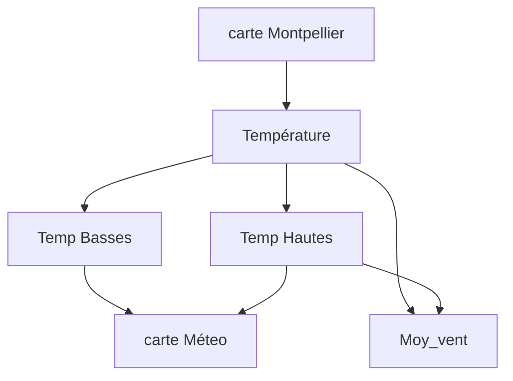

# Montpellier-Weather

## But et Données 

l'Objectif de ce projet est de créer une application Web de prévision météo Pour la ville de Montpellier  dans laquelle , on pourra afficher principalement les températures hautes et basses , suivie de la moyenne du vent et la quantité de précipitation du vent 

 Cette carte se met à jour automatiquement et accessible avec l'URL ... 

 ## Organisation 

 ### Traitement des données 

 Dans cette première partie du travail  je vais impérativement analyser , filtrer et organiser les données de manière à ce que notre dataframe soit soit utilisable , et ceci pour se faire à l'aide des packages suivants : pandas , numpy , scipy .

 ### Visualisation  

 Cette partie consiste à créer une carte graphique affichant la température d'une journée dans la ville de Montpellier en suivant differentes étapes : 

 
